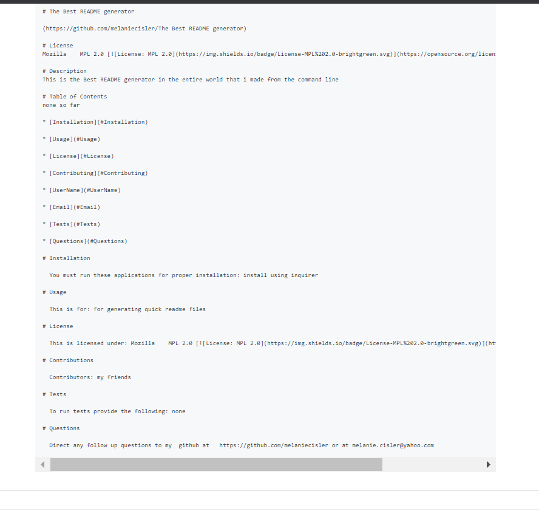

# README-Generator
Created a command-line application that dynamically generates a professional README.md from a user's input using the Inquirer package

Name: README-Generator
Description: Created a command-line application that dynamically generates a professional README.md from a user's input using the Inquirer package.

Technologies used: Node.JS, JavaScript, CLI, Inquirer. 

Challenges:  Setting up my License list was a challenge but then realized that some simple punctuation was the culprit.  

Future development: Perhaps find a way to add in a gif or video link to my demo within the actual readme file 

Installation: Must use npm install inquirer --save             
  Using Chrome or a favorite browser copy link https://melaniecisler.github.io/README-Generator.  

Run: node index.js

Authors and acknowledgment: Developed by Melanie Cisler

Link to video demo:  https://drive.google.com/file/d/17XQYXRLW1wgQYrb99ZmnZC4Xlp3cibZJ/view  
