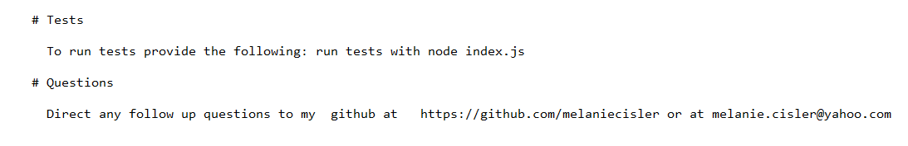

# README-Generator
Created a command-line application that dynamically generates a professional README.md from a user's input using the Inquirer package

Name: README-Generator
Description: Created a command-line application that dynamically generates a professional README.md from a user's input using the Inquirer package.

Technologies used: Node.JS, JavaScript, CLI, Inquirer. 

Challenges:  Setting up my License list was a challenge but then realized that some simple punctuation was the culprit.  

Future development: Perhaps find a way to add in a gif or video link to my demo within the actual readme file 

Installation: Must use npm install inquirer --save             
  Using Chrome or a favorite browser copy link https://melaniecisler.github.io/README-Generator.  

Run: node index.js

Authors and acknowledgment: Developed by Melanie Cisler

Link to video demo:  https://drive.google.com/file/d/17XQYXRLW1wgQYrb99ZmnZC4Xlp3cibZJ/view  

****************************************************************

Example Created:

# The Best README Generator on the Planet
    
    (https://github.com/melaniecisler/The Best README Generator on the Planet)

    # License
    MIT   

    # Description
    This project created a command-line application that dynamically generates a professional README.md
    
    # Table of Contents
    Installation, Usage, License, Contributing, UserName, Email, Tests, Questions

    [Installation](#installation)

    [Usage](#usage)

    [License](#license)

    [Contributing](#contributing)

    [UserName](#userName)

    [Email](#email)

    [Tests](#tests)

    [Questions](#questions)

    # Installation

      You must run these applications for proper installation: This is for when you need a readme file for any project

    # Usage

      This is for: use node index.js

    # License

      This is licensed under: MIT   

    # Contributions

      Contributors: melaniecisler

    # Tests

      To run tests provide the following: run tests with node index.js
 
    # Questions

      Direct any follow up questions to my  github at   https://github.com/melaniecisler or at melanie.cisler@yahoo.com 
    
